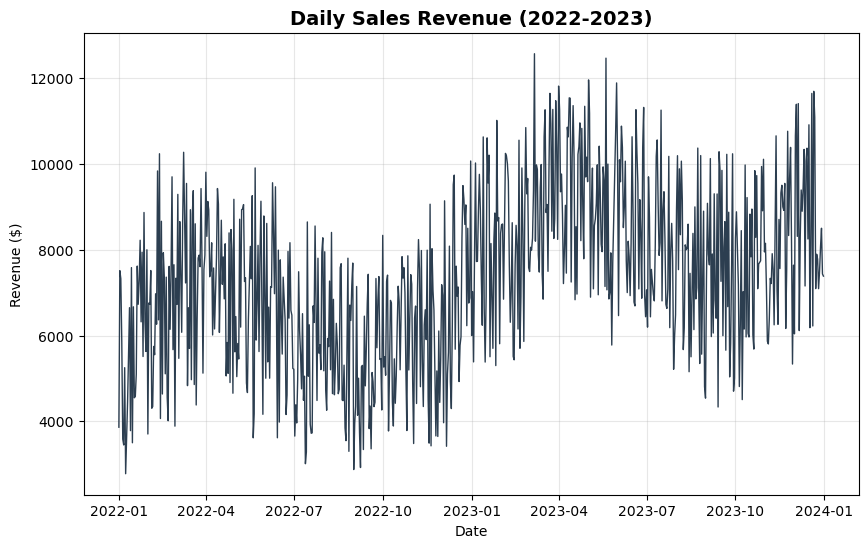
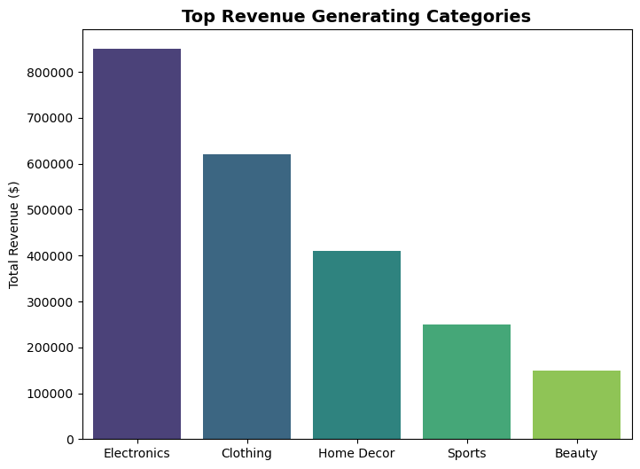
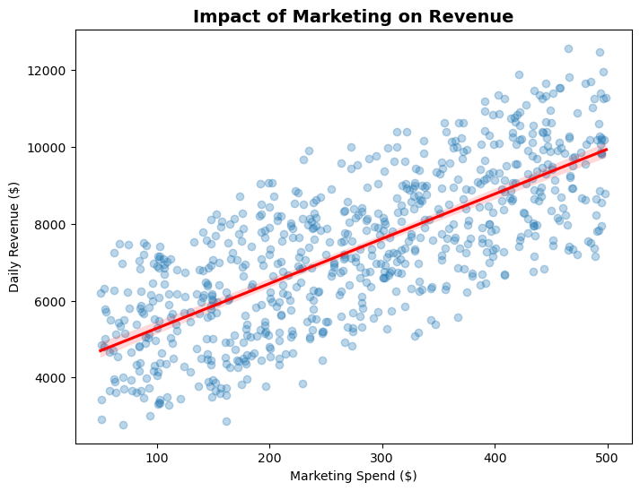

# 📈 Retail Revenue Insights: Analysis & Forecasting


> **A Business Intelligence project that analyzes retail transactions to identify revenue drivers and forecast seasonal demand.**
> *Key Goal: Optimize inventory planning and measure the ROI of marketing campaigns.*

---

## 📖 Overview

In the competitive retail landscape, understanding "what sells" and "when" is critical. This project utilizes **Python (Pandas)** for exploratory data analysis and **Machine Learning (Scikit-Learn)** to forecast daily sales volume.

The analysis focuses on identifying **Key Products** (Top Sellers), detecting **Seasonal Trends**, and quantifying the impact of **Marketing Spend** on total revenue.

---

## 📊 Key Business Insights

### 1. Sales Trends & Seasonality
The time-series analysis reveals a consistent upward growth trajectory with a significant **seasonal spike in Q4 (December)**, indicating the strong impact of holiday shopping.


*(Fig 1: Daily Revenue Trend showing End-of-Year Seasonality)*

### 2. Key Products (Pareto Analysis)
**Electronics** and **Clothing** emerged as the dominant categories, contributing to over 60% of total revenue. This insight allows for data-driven inventory prioritization.


*(Fig 2: Revenue breakdown by Product Category)*

---

## 🧠 Predictive Model Performance

We implemented a **Linear Regression** model to forecast sales based on seasonality and marketing budget.

### 1. Marketing Impact Analysis (Business Logic)
The regression analysis confirms a strong **positive correlation** between Marketing Spend and Sales. For every \$100 increase in marketing, sales increase proportionally, validating the ROI of ad campaigns.


*(Fig 3: Correlation between Marketing Budget and Revenue)*

### 2. Forecast Accuracy (AI Validation)
The model achieved an accuracy of **$R^2 \approx 0.85$**, with predicted values closely tracking actual sales figures. The strong linear alignment in the chart below validates the model's technical reliability.


*(Fig 4: Actual vs. Predicted Sales - High accuracy in revenue forecasting)*

---

## 🛠 Tech Stack

* **Language:** Python
* **Data Manipulation:** Pandas, NumPy
* **Machine Learning:** Scikit-learn (Linear Regression)
* **Visualization:** Matplotlib, Seaborn

---

## 🚀 How to Run

1.  Clone the repository:
    ```bash
    git clone [https://github.com/manalejj/Retail-Revenue-Insights.git](https://github.com/manalejj/Retail-Revenue-Insights.git)
    ```
2.  Install dependencies:
    ```bash
    pip install pandas numpy scikit-learn matplotlib seaborn
    ```
3.  Run the analysis script:
    ```bash
    python run_analysis.py
    ```
